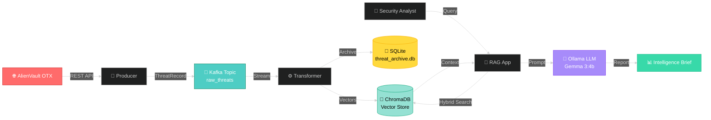

<div align="center">

# 🛡️ CyberThreat Intelligence System

### Real-Time Threat Detection & Analysis with RAG Architecture

_Turning chaos into actionable intelligence, one threat at a time_

[](https://www.python.org/)
[](https://kafka.apache.org/)
[](https://ollama.com/)
[](LICENSE)

**[Features](#-key-features)** • **[Architecture](#-architecture)** • **[Quick Start](#-quick-start)** • **[Demo](#-demo)**

</div>

---

## 💡 What is This?

A **RAG (Retrieval-Augmented Generation)** system that continuously monitors cyber threats from **AlienVault OTX**, processes them in real-time using **Apache Kafka**, and delivers AI-powered intelligence reports through **Ollama's Gemma 3:4b** LLM.

Think of it as your **personal cyber threat analyst** that never sleeps. 🕵️‍♂️

---

## ✨ Key Features

<table>
<tr>
<td width="50%">

### 🚀 Real-Time Processing

- **Live ingestion** from AlienVault OTX
- **Kafka streaming** for scalable data flow
- **60-minute time window** for fresh intelligence

</td>
<td width="50%">

### 🧠 AI-Powered Analysis

- **Hybrid search** (semantic + keyword)
- **Vector embeddings** with ChromaDB
- **LLM reports** with IoCs & recommendations

</td>
</tr>
<tr>
<td width="50%">

### 🔍 Smart Detection

- Automatic **deduplication**
- **Severity classification** (Low/Med/High)
- **IOC extraction** (IPs, domains, hashes)

</td>
<td width="50%">

### 💾 Dual Storage

- **SQLite** for long-term archival
- **ChromaDB** for fast retrieval
- **Timestamp-based filtering**

</td>
</tr>
</table>

---

## 🏗️ Architecture



### 🔄 How It Works

```
┌─────────────────┐
│  1. INGESTION   │  OTX Producer fetches threat pulses every 60s
└────────┬────────┘
         │
┌────────▼────────┐
│  2. STREAMING   │  Kafka distributes ThreatRecord messages
└────────┬────────┘
         │
┌────────▼────────┐
│ 3. PROCESSING   │  Transformer extracts IOCs & stores data
└────────┬────────┘
         │
┌────────▼────────┐
│  4. RETRIEVAL   │  Hybrid search finds relevant threats (last 60min)
└────────┬────────┘
         │
┌────────▼────────┐
│ 5. GENERATION   │  Gemma 3:4b creates actionable intelligence report
└─────────────────┘
```

---

## 📁 Project Structure

```
CyberThreat-Intelligence/
│
├── 🎯 app.py                    # Main CLI application
├── 📋 requirements.txt          # Python dependencies
│
├── 🧠 brain/                    # Intelligence layer
│   ├── retriever.py            # Hybrid search engine
│   └── generator.py            # LLM report generator
│
├── 📡 ingestion/                # Data pipeline
│   ├── producers/
│   │   └── otx_producer.py     # AlienVault OTX ingestion
│   └── consumers/
│       └── transformer.py      # Kafka → Storage processor
│
├── 📊 schemas/                  # Data models
│   └── threat_model.py         # ThreatRecord schema
│
└── 💾 data/                     # Runtime databases
    ├── threat_archive.db       # SQLite archival
    └── chroma_db/              # ChromaDB vector store
```

---

## 🚀 Quick Start

### Prerequisites

| Tool           | Version | Purpose                    |
| -------------- | ------- | -------------------------- |
| 🐍 Python      | 3.8+    | Runtime environment        |
| ☕ Java        | 8+      | Kafka/Zookeeper dependency |
| 🤖 Ollama      | Latest  | Local LLM inference        |
| 🔑 OTX API Key | -       | AlienVault access          |

### ⚡ Installation (3 minutes)

```bash
# 1️⃣ Navigate to project
cd kafka_2.12-3.6.0

# 2️⃣ Create virtual environment
python3 -m venv .venv
source .venv/bin/activate  # Windows: .venv\Scripts\activate

# 3️⃣ Install dependencies
pip install -r CyberThreat-Intelligence/requirements.txt

# 4️⃣ Install Ollama & download model
curl -fsSL https://ollama.com/install.sh | sh  # Linux/WSL
ollama pull gemma3:4b
```

---

## 🎬 Running the System

### 🔥 Full Pipeline (7 terminals)

<details>
<summary><b>Click to expand step-by-step guide</b></summary>

#### Terminal 1️⃣: Zookeeper

```bash
bin/zookeeper-server-start.sh config/zookeeper.properties
```

#### Terminal 2️⃣: Kafka Broker

```bash
bin/kafka-server-start.sh config/server.properties
```

#### Terminal 3️⃣: Create Kafka Topic

```bash
bin/kafka-topics.sh --bootstrap-server localhost:9092 \
  --create --topic raw_threats --partitions 1 --replication-factor 1
```

#### Terminal 4️⃣: Ollama Server

```bash
ollama serve
```

#### Terminal 5️⃣: OTX Producer

```bash
python CyberThreat-Intelligence/ingestion/producers/otx_producer.py
```

**Expected output:**

```
[INGESTION] OTX ingestion started
[INGESTION] Sent 15 new pulses (received 20)
```

#### Terminal 6️⃣: Transformer (CRITICAL)

```bash
python CyberThreat-Intelligence/ingestion/consumers/transformer.py
```

**Expected output:**

```
🚀 Transformer Consumer is listening...
Processed: OTX - Phishing at 1703456789.123
```

⏳ **Wait 30-60 seconds** for data to populate before querying!

#### Terminal 7️⃣: Launch Application

```bash
python CyberThreat-Intelligence/app.py
```

</details>

---

## 🎯 Demo

### Example Query Session

```bash
$ python CyberThreat-Intelligence/app.py

🛡️ Cyber Threat Intelligence Reporter Active

Enter your query: What are the latest phishing campaigns?

🔍 Searching last 60 minutes of data...
🧠 Generating intelligence report via Gemma 3:4b...

==================================================
              FINAL THREAT BRIEF
==================================================

📌 SUMMARY
In the past hour, 12 new phishing campaigns were detected
targeting financial institutions. Primary vectors include
credential harvesting via fake login portals.

🎯 INDICATORS OF COMPROMISE (IOCs)
• IPs: 192.168.1.100, 10.0.0.45
• Domains: fake-bank-login[.]com, secure-verify[.]net
• Hashes: a1b2c3d4e5f6...

⚠️ SEVERITY: HIGH

🛠️ RECOMMENDED ACTIONS
1. Block listed IPs at perimeter firewall
2. Add domains to DNS blacklist
3. Alert security awareness training team
4. Monitor for similar patterns in next 24h

==================================================
```

---

## 🔧 Configuration

### Environment Variables (Optional)

Create a `.env` file in the project root:

```bash
OTX_API_KEY=your_otx_api_key_here
KAFKA_BROKER=localhost:9092
OLLAMA_HOST=http://localhost:11434
```

### Key Parameters

| Component | Setting       | Default       | Notes                          |
| --------- | ------------- | ------------- | ------------------------------ |
| Kafka     | Topic         | `raw_threats` | Can be changed in code         |
| OTX       | Poll Interval | 60s           | Line 12 in `otx_producer.py`   |
| ChromaDB  | Time Window   | 60 min        | Configurable in `retriever.py` |
| Ollama    | Model         | `gemma3:4b`   | 3.3 GB download                |

---

## 🧪 Testing & Verification

### Check Kafka Messages

```bash
bin/kafka-console-consumer.sh --bootstrap-server localhost:9092 \
  --topic raw_threats --from-beginning
```

### Inspect ChromaDB

```python
import chromadb
client = chromadb.PersistentClient(path="./data/chroma_db")
collection = client.get_collection(name="threat_intel")
print(f"📊 Total threats: {collection.count()}")
```

### Test Ollama Connection

```bash
curl http://localhost:11434/api/version
```

---

## 🐛 Troubleshooting

<details>
<summary><b>❌ Error: Collection [threat_intel] does not exist</b></summary>

**Cause:** Transformer hasn't created the ChromaDB collection yet.

**Fix:**

1. Ensure transformer is running
2. Wait 30 seconds for first messages to process
3. Retry query

</details>

<details>
<summary><b>❌ Error: Failed to connect to Ollama</b></summary>

**Cause:** Ollama server not running.

**Fix:**

```bash
# Check if running
curl http://localhost:11434/api/version

# If not, start it
ollama serve
```

</details>

<details>
<summary><b>❌ No threats found in last 60 minutes</b></summary>

**Cause:** No recent data or producer not running.

**Fix:**

1. Check producer logs for errors
2. Verify OTX API key is valid
3. Check transformer is processing messages

</details>

---

## 📚 Tech Stack

<div align="center">

| Layer              | Technology          | Purpose                      |
| ------------------ | ------------------- | ---------------------------- |
| 🌐 **Data Source** | AlienVault OTX      | Threat intelligence feeds    |
| 📡 **Streaming**   | Apache Kafka 3.6.0  | Distributed message broker   |
| 🔮 **Vector DB**   | ChromaDB            | Semantic search & embeddings |
| 💾 **Archive**     | SQLite              | Long-term data storage       |
| 🧠 **LLM**         | Ollama (Gemma 3:4b) | Natural language generation  |
| 🐍 **Backend**     | Python 3.8+         | Core application logic       |
| ✅ **Validation**  | Pydantic            | Data schema validation       |

</div>

## 🧠 Enriched Threat Intelligence Pipeline
In this part, the system was **architecturally designed to support multiple threat intelligence sources**
(AlienVault OTX, VirusTotal, MISP) , each intelligence source is isolated in its own Kafka producer 
and normalized into a shared ThreatRecord schema, ensuring downstream components remain source-agnostic.
while the **final operational pipeline focuses on a single
reliable ingestion source** due to practical constraints.

## 🔹 AlienVault OTX

**Role:** Primary ingestion source

AlienVault OTX is the main threat intelligence feed actively used by the system. It provides Indicators of Compromise (IoCs), campaign context, and threat-related metadata.

The data is continuously ingested using a Kafka-based pipeline.

- Provides IPs, domains, URLs, and file hashes
- Includes campaign and pulse context
- Community-driven and frequently updated
- Actively ingested via a Kafka producer (`otx_producer.py`)

## ⚠️ Explored but Not Fully Integrated Sources

The following sources were explored during development but were **not enabled in the final
ingestion pipeline due to practical limitations**.

### 🔸 VirusTotal

**Role:** IoC enrichment

VirusTotal was intended to enrich IoCs with reputation information such as detection counts and antivirus verdicts.

Although VirusTotal offers valuable enrichment capabilities, it was excluded from the live ingestion pipeline due to the following constraints:

- **Strict API rate limits** on free access tiers
- **Commercial licensing requirements** for sustained or large-scale usage
- Poor suitability for **continuous, near real-time ingestion** without paid access

As a result, VirusTotal was deemed incompatible with the project’s runtime ingestion requirements and operational goals.

Quota exceeded notification:
```
Hello,

This is a notification to inform you that you have exceeded the following VirusTotal service component allowance:

Component: Daily VirusTotal API calls
Affected account: Pacman888
Quota limit: 500 requests
Quota consumed: 500 requests
Notification date: 2025-12-29 at 12:30 (UTC)

All further usage of the affected component is currently capped until the next metering period.
At a technical level, any additional web or API requests will receive a "429 Quota Exceeded" HTTP status code.

As a result, any scripts, automated workflows, or integrations relying on this service may temporarily fail.
```

### 🔸 MISP (CERT-FR Public Feed)

**Role:** Supplementary threat intelligence source 

MISP ingestion was explored using the CERT-FR public feed, but practical limitations prevented effective integration:

- Public feeds expose only **partial, attribute-level data**
- **Full event context** (relationships, timelines, campaign structure) is unavailable
- **Real-time ingestion** is limited and inconsistent and do not change frequently.

Effective use of MISP would require deploying and maintaining a **private MISP instance** with full event access, synchronization, and governance.  
Such a setup would be disproportionately complex and resource-intensive for a small-scale academic project.


## 🏗️ Overall Pipeline Design (Multi-Source)

```
┌──────────────────────────┐
│       1. INGESTION       │ 
│                          │     
│ • OTX Producer           │       Pulls raw threat intel  
│ • MISP Producer          │        
└────────────┬─────────────┘
             │
             ▼
┌──────────────────────────┐
│       2. STREAMING       │
│                          │
│ Topic: raw_threats       │
│ Unified ThreatRecord     │
│ (IOC, source, timestamp) │
└────────────┬─────────────┘
             │
             ▼
┌──────────────────────────┐
│      3. ENRICHMENT       │
│                          │    • Queries VirusTotal (Not used in ingestion because of rate limits)
│ vt_enricher.py           │    • Consumer from raw_threats
│ Consumer and Producer    │    • Producer to enriched_threats     │   
└────────────┬─────────────┘    
             │
             ▼
┌──────────────────────────┐
│       4. STREAMING       │
│                          │
│ Topic: enriched_threats  │
│ Fully enriched records   │
└────────────┬─────────────┘
             │
             ▼
┌──────────────────────────┐
│      5. INDEXING         │
│                          │
│ enriched_transformer.py  │
│ • SQLite (metadata)      │
│ • ChromaDB (embeddings)  │
│ • IOC → Vector mapping   │
└────────────┬─────────────┘
             │
             ▼
┌──────────────────────────┐
│      6. RETRIEVAL        │
│                          │
│ RAG Query Engine         │
│ • Hybrid search          │
│   (time + similarity)    │
│ • IOC / campaign aware   │
└────────────┬─────────────┘
             │
             ▼
┌──────────────────────────┐
│      7. GENERATION       │
└──────────────────────────┘
```
# Conclusion of Multi-Source RAG Design

In the final implementation, **AlienVault OTX** was selected as the sole active threat intelligence ingestion source.  
This decision was driven by practical constraints related to accessibility, cost, and operational feasibility rather than theoretical completeness.


## Why AlienVault OTX Was Used

AlienVault OTX was chosen because it aligns well with the project’s real-time cyber threat reporting objectives:

- Provides **context-rich threat intelligence**, not just raw indicators of compromise
- Freely accessible with **no restrictive licensing requirements**
- Supports **near real-time ingestion**, suitable for SOC-style analysis
- Integrates naturally into a **Kafka-based streaming architecture**

For automated intelligence report generation, OTX offered the most balanced trade-off between data quality, contextual depth, and operational simplicity. 

Although VirusTotal and MISP offer valuable intelligence, their access limitations and operational overhead made them unsuitable for this project’s real-time ingestion goals.

The final architecture prioritizes operational realism, reproducibility, and sustainability, while remaining multi-source ready for future extensions.

## 🎓 Learning Resources

- [Apache Kafka Documentation](https://kafka.apache.org/documentation/)
- [ChromaDB Guide](https://docs.trychroma.com/)
- [Ollama Documentation](https://github.com/ollama/ollama)
- [AlienVault OTX API](https://otx.alienvault.com/api)

---

## 👥 Contributors

<table>
<tr>
<td align="center">
<a href="https://github.com/Jalalbaim">
<br />
<sub><b>MJ. BAIM</b></sub>
</a><br />
💻 🔧 📖
</td>
<td align="center">
<a href="https://github.com/ayman-orkhis">
<br />
<sub><b>A. ORKHIS</b></sub>
<br />
💻 🔧 📖
</td>
</tr>
</table>

---

## 📄 License

This project is for **educational purposes** as part of a Cybersecurity Intelligence course.

---

## ⚠️ Security Notice

> **🔐 Important:** Never commit API keys to version control. Use environment variables or `.env` files (add to `.gitignore`).

---

<div align="center">

### 🌟 If this project helped you, consider giving it a star!

Made with ❤️ by cybersecurity enthusiasts

**[⬆ Back to Top](#-cyberthreat-intelligence-system)**

</div>
