<div align="center">

# 🛡️ CyberThreat Intelligence System

### Real-Time Threat Detection & Analysis with RAG Architecture

_Turning chaos into actionable intelligence, one threat at a time_

[](https://www.python.org/)
[](https://kafka.apache.org/)
[](https://ollama.com/)
[](LICENSE)

**[Features](#-key-features)** • **[Architecture](#-architecture)** • **[Quick Start](#-quick-start)** • **[Demo](#-demo)**

</div>

---

## 💡 What is This?

A **RAG (Retrieval-Augmented Generation)** system that continuously monitors cyber threats from **AlienVault OTX**, processes them in real-time using **Apache Kafka**, and delivers AI-powered intelligence reports through **Ollama's Gemma 3:4b** LLM.

Think of it as your **personal cyber threat analyst** that never sleeps. 🕵️‍♂️

---

## ✨ Key Features

<table>
<tr>
<td width="50%">

### 🚀 Real-Time Processing

- **Live ingestion** from AlienVault OTX
- **Kafka streaming** for scalable data flow
- **60-minute time window** for fresh intelligence

</td>
<td width="50%">

### 🧠 AI-Powered Analysis

- **Hybrid search** (semantic + keyword)
- **Vector embeddings** with ChromaDB
- **LLM reports** with IoCs & recommendations

</td>
</tr>
<tr>
<td width="50%">

### 🔍 Smart Detection

- Automatic **deduplication**
- **Severity classification** (Low/Med/High)
- **IOC extraction** (IPs, domains, hashes)

</td>
<td width="50%">

### 💾 Dual Storage

- **SQLite** for long-term archival
- **ChromaDB** for fast retrieval
- **Timestamp-based filtering**

</td>
</tr>
</table>

---

## 🏗️ Architecture

```mermaid
%%{init: {'theme':'dark'}}%%
graph LR
    A[🌐 AlienVault OTX] -->|REST API| B[📡 Producer]
    B -->|ThreatRecord| C[📨 Kafka Topic<br/>raw_threats]
    C -->|Stream| D[⚙️ Transformer]
    D -->|Vectors| E[(🔮 ChromaDB<br/>Vector Store)]
    D -->|Archive| F[(💾 SQLite<br/>threat_archive.db)]
    G[👤 Security Analyst] -->|Query| H[🤖 RAG App]
    H -->|Hybrid Search| E
    E -->|Context| H
    H -->|Prompt| I[🧠 Ollama LLM<br/>Gemma 3:4b]
    I -->|Report| J[📊 Intelligence Brief]

    style A fill:#ff6b6b,stroke:#c92a2a,color:#fff
    style C fill:#4ecdc4,stroke:#087f5b,color:#fff
    style E fill:#95e1d3,stroke:#0ca678,color:#000
    style F fill:#ffd93d,stroke:#fab005,color:#000
    style I fill:#a78bfa,stroke:#7c3aed,color:#fff
    style J fill:#38d9a9,stroke:#12b886,color:#fff
```



### 🔄 How It Works

```
┌─────────────────┐
│  1. INGESTION   │  OTX Producer fetches threat pulses every 60s
└────────┬────────┘
         │
┌────────▼────────┐
│  2. STREAMING   │  Kafka distributes ThreatRecord messages
└────────┬────────┘
         │
┌────────▼────────┐
│ 3. PROCESSING   │  Transformer extracts IOCs & stores data
└────────┬────────┘
         │
┌────────▼────────┐
│  4. RETRIEVAL   │  Hybrid search finds relevant threats (last 60min)
└────────┬────────┘
         │
┌────────▼────────┐
│ 5. GENERATION   │  Gemma 3:4b creates actionable intelligence report
└─────────────────┘
```

---

## 📁 Project Structure

```
CyberThreat-Intelligence/
│
├── 🎯 app.py                    # Main CLI application
├── 📋 requirements.txt          # Python dependencies
│
├── 🧠 brain/                    # Intelligence layer
│   ├── retriever.py            # Hybrid search engine
│   └── generator.py            # LLM report generator
│
├── 📡 ingestion/                # Data pipeline
│   ├── producers/
│   │   └── otx_producer.py     # AlienVault OTX ingestion
│   └── consumers/
│       └── transformer.py      # Kafka → Storage processor
│
├── 📊 schemas/                  # Data models
│   └── threat_model.py         # ThreatRecord schema
│
└── 💾 data/                     # Runtime databases
    ├── threat_archive.db       # SQLite archival
    └── chroma_db/              # ChromaDB vector store
```

---

## 🚀 Quick Start

### Prerequisites

| Tool           | Version | Purpose                    |
| -------------- | ------- | -------------------------- |
| 🐍 Python      | 3.8+    | Runtime environment        |
| ☕ Java        | 8+      | Kafka/Zookeeper dependency |
| 🤖 Ollama      | Latest  | Local LLM inference        |
| 🔑 OTX API Key | -       | AlienVault access          |

### ⚡ Installation (3 minutes)

```bash
# 1️⃣ Navigate to project
cd kafka_2.12-3.6.0

# 2️⃣ Create virtual environment
python3 -m venv .venv
source .venv/bin/activate  # Windows: .venv\Scripts\activate

# 3️⃣ Install dependencies
pip install -r CyberThreat-Intelligence/requirements.txt

# 4️⃣ Install Ollama & download model
curl -fsSL https://ollama.com/install.sh | sh  # Linux/WSL
ollama pull gemma3:4b
```

---

## 🎬 Running the System

### 🔥 Full Pipeline (7 terminals)

<details>
<summary><b>Click to expand step-by-step guide</b></summary>

#### Terminal 1️⃣: Zookeeper

```bash
bin/zookeeper-server-start.sh config/zookeeper.properties
```

#### Terminal 2️⃣: Kafka Broker

```bash
bin/kafka-server-start.sh config/server.properties
```

#### Terminal 3️⃣: Create Kafka Topic

```bash
bin/kafka-topics.sh --bootstrap-server localhost:9092 \
  --create --topic raw_threats --partitions 1 --replication-factor 1
```

#### Terminal 4️⃣: Ollama Server

```bash
ollama serve
```

#### Terminal 5️⃣: OTX Producer

```bash
python CyberThreat-Intelligence/ingestion/producers/otx_producer.py
```

**Expected output:**

```
[INGESTION] OTX ingestion started
[INGESTION] Sent 15 new pulses (received 20)
```

#### Terminal 6️⃣: Transformer (CRITICAL)

```bash
python CyberThreat-Intelligence/ingestion/consumers/transformer.py
```

**Expected output:**

```
🚀 Transformer Consumer is listening...
Processed: OTX - Phishing at 1703456789.123
```

⏳ **Wait 30-60 seconds** for data to populate before querying!

#### Terminal 7️⃣: Launch Application

```bash
python CyberThreat-Intelligence/app.py
```

</details>

---

## 🎯 Demo

### Example Query Session

```bash
$ python CyberThreat-Intelligence/app.py

🛡️ Cyber Threat Intelligence Reporter Active

Enter your query: What are the latest phishing campaigns?

🔍 Searching last 60 minutes of data...
🧠 Generating intelligence report via Gemma 3:4b...

==================================================
              FINAL THREAT BRIEF
==================================================

📌 SUMMARY
In the past hour, 12 new phishing campaigns were detected
targeting financial institutions. Primary vectors include
credential harvesting via fake login portals.

🎯 INDICATORS OF COMPROMISE (IOCs)
• IPs: 192.168.1.100, 10.0.0.45
• Domains: fake-bank-login[.]com, secure-verify[.]net
• Hashes: a1b2c3d4e5f6...

⚠️ SEVERITY: HIGH

🛠️ RECOMMENDED ACTIONS
1. Block listed IPs at perimeter firewall
2. Add domains to DNS blacklist
3. Alert security awareness training team
4. Monitor for similar patterns in next 24h

==================================================
```

---

## 🔧 Configuration

### Environment Variables (Optional)

Create a `.env` file in the project root:

```bash
OTX_API_KEY=your_otx_api_key_here
KAFKA_BROKER=localhost:9092
OLLAMA_HOST=http://localhost:11434
```

### Key Parameters

| Component | Setting       | Default       | Notes                          |
| --------- | ------------- | ------------- | ------------------------------ |
| Kafka     | Topic         | `raw_threats` | Can be changed in code         |
| OTX       | Poll Interval | 60s           | Line 12 in `otx_producer.py`   |
| ChromaDB  | Time Window   | 60 min        | Configurable in `retriever.py` |
| Ollama    | Model         | `gemma3:4b`   | 3.3 GB download                |

---

## 🧪 Testing & Verification

### Check Kafka Messages

```bash
bin/kafka-console-consumer.sh --bootstrap-server localhost:9092 \
  --topic raw_threats --from-beginning
```

### Inspect ChromaDB

```python
import chromadb
client = chromadb.PersistentClient(path="./data/chroma_db")
collection = client.get_collection(name="threat_intel")
print(f"📊 Total threats: {collection.count()}")
```

### Test Ollama Connection

```bash
curl http://localhost:11434/api/version
```

---

## 🐛 Troubleshooting

<details>
<summary><b>❌ Error: Collection [threat_intel] does not exist</b></summary>

**Cause:** Transformer hasn't created the ChromaDB collection yet.

**Fix:**

1. Ensure transformer is running
2. Wait 30 seconds for first messages to process
3. Retry query

</details>

<details>
<summary><b>❌ Error: Failed to connect to Ollama</b></summary>

**Cause:** Ollama server not running.

**Fix:**

```bash
# Check if running
curl http://localhost:11434/api/version

# If not, start it
ollama serve
```

</details>

<details>
<summary><b>❌ No threats found in last 60 minutes</b></summary>

**Cause:** No recent data or producer not running.

**Fix:**

1. Check producer logs for errors
2. Verify OTX API key is valid
3. Check transformer is processing messages

</details>

---

## 📚 Tech Stack

<div align="center">

| Layer              | Technology          | Purpose                      |
| ------------------ | ------------------- | ---------------------------- |
| 🌐 **Data Source** | AlienVault OTX      | Threat intelligence feeds    |
| 📡 **Streaming**   | Apache Kafka 3.6.0  | Distributed message broker   |
| 🔮 **Vector DB**   | ChromaDB            | Semantic search & embeddings |
| 💾 **Archive**     | SQLite              | Long-term data storage       |
| 🧠 **LLM**         | Ollama (Gemma 3:4b) | Natural language generation  |
| 🐍 **Backend**     | Python 3.8+         | Core application logic       |
| ✅ **Validation**  | Pydantic            | Data schema validation       |

</div>

---

## 🎓 Learning Resources

- [Apache Kafka Documentation](https://kafka.apache.org/documentation/)
- [ChromaDB Guide](https://docs.trychroma.com/)
- [Ollama Documentation](https://github.com/ollama/ollama)
- [AlienVault OTX API](https://otx.alienvault.com/api)

---

## 👥 Contributors

<table>
<tr>
<td align="center">
<a href="https://github.com/Jalalbaim">
<br />
<sub><b>MJ. BAIM</b></sub>
</a><br />
💻 🔧 📖
</td>
<td align="center">
<br />
<sub><b>A. ORKHIS</b></sub>
<br />
💻 🔧 📖
</td>
</tr>
</table>

---

## 📄 License

This project is for **educational purposes** as part of a Cybersecurity Intelligence course.

---

## ⚠️ Security Notice

> **🔐 Important:** Never commit API keys to version control. Use environment variables or `.env` files (add to `.gitignore`).

---

<div align="center">

### 🌟 If this project helped you, consider giving it a star!

Made with ❤️ by cybersecurity enthusiasts

**[⬆ Back to Top](#-cyberthreat-intelligence-system)**

</div>
